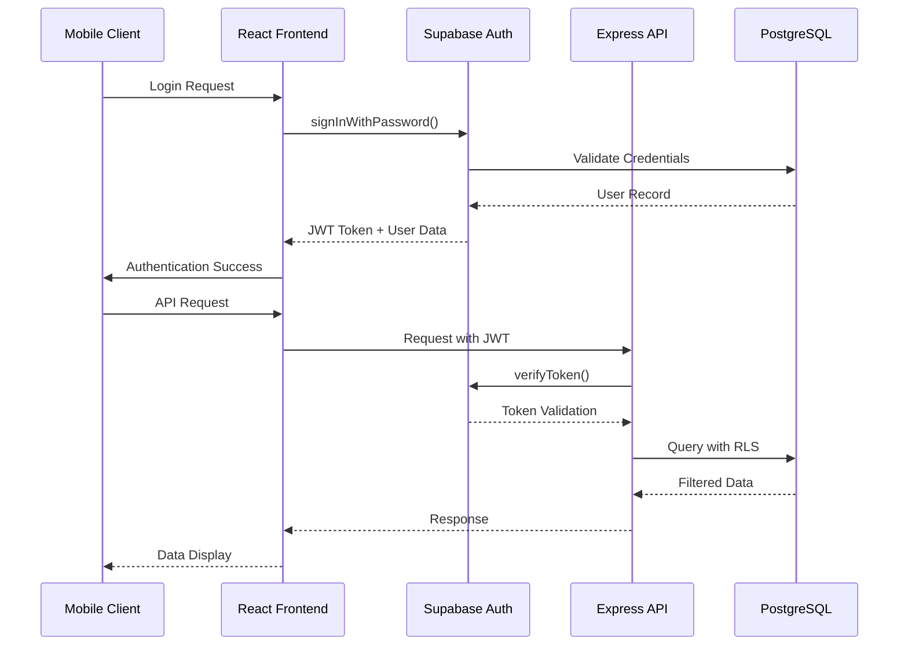

# Backend Architecture

## Service Architecture

### Serverless Architecture
Based on Railway/Render hosting with Express.js

### Function Organization
```
src/
├── routes/               # API route definitions
│   ├── auth.ts          # Authentication endpoints
│   ├── workOrders.ts    # Work order CRUD
│   ├── equipment.ts     # Equipment management
│   ├── spareParts.ts    # Inventory management
│   ├── users.ts         # User management
│   └── kpi.ts           # Analytics endpoints
├── services/            # Business logic
│   ├── authService.ts
│   ├── workOrderService.ts
│   ├── equipmentService.ts
│   ├── sparePartService.ts
│   └── kpiService.ts
├── middleware/          # Express middleware
│   ├── auth.ts          # JWT verification
│   ├── validation.ts    # Input validation
│   ├── errorHandler.ts  # Error handling
│   └── rbac.ts          # Role-based access control
├── models/              # Data models
│   ├── User.ts
│   ├── WorkOrder.ts
│   ├── Equipment.ts
│   └── SparePart.ts
├── utils/               # Utilities
│   ├── database.ts      # Supabase client
│   ├── validators.ts    # Input validation schemas
│   └── logger.ts        # Logging configuration
└── types/               # TypeScript definitions
    ├── api.ts
    ├── database.ts
    └── auth.ts
```

### Function Template
```typescript
import { Request, Response } from 'express';
import { workOrderService } from '@/services/workOrderService';
import { validateCreateWorkOrder } from '@/utils/validators';
import { requireRole } from '@/middleware/rbac';

export const createWorkOrder = [
  requireRole('supervisor'),
  validateCreateWorkOrder,
  async (req: Request, res: Response) => {
    try {
      const { userId } = req.auth;
      const workOrderData = {
        ...req.body,
        createdById: userId,
      };

      const workOrder = await workOrderService.create(workOrderData);

      res.status(201).json({
        success: true,
        data: workOrder,
      });
    } catch (error) {
      res.status(500).json({
        success: false,
        error: {
          code: 'CREATION_FAILED',
          message: 'Failed to create work order',
          timestamp: new Date().toISOString(),
          requestId: req.id,
        },
      });
    }
  },
];
```

## Database Architecture

### Schema Design
See Database Schema section above for complete SQL DDL

### Data Access Layer
```typescript
import { supabase } from '@/utils/database';
import { WorkOrder, CreateWorkOrderData } from '@/types/models';

export class WorkOrderRepository {
  async create(data: CreateWorkOrderData): Promise<WorkOrder> {
    const { data: result, error } = await supabase
      .from('work_orders')
      .insert(data)
      .select()
      .single();

    if (error) throw new Error(`Database error: ${error.message}`);
    return result;
  }

  async findByAssignedOperator(operatorId: string): Promise<WorkOrder[]> {
    const { data, error } = await supabase
      .from('work_orders')
      .select('*')
      .eq('assigned_operator_id', operatorId)
      .order('created_at', { ascending: false });

    if (error) throw new Error(`Database error: ${error.message}`);
    return data || [];
  }

  async updateStatus(id: string, status: string, userId: string): Promise<WorkOrder> {
    const updates: any = { status };

    if (status === 'in_execution') {
      updates.started_at = new Date().toISOString();
    } else if (status === 'completed') {
      updates.completed_at = new Date().toISOString();
      updates.completed_by_id = userId;
    }

    const { data, error } = await supabase
      .from('work_orders')
      .update(updates)
      .eq('id', id)
      .select()
      .single();

    if (error) throw new Error(`Database error: ${error.message}`);

    // Create audit trail entry
    await this.createAuditEntry(id, userId, status);

    return data;
  }

  private async createAuditEntry(workOrderId: string, userId: string, newStatus: string): Promise<void> {
    await supabase
      .from('work_order_audit')
      .insert({
        work_order_id: workOrderId,
        user_id: userId,
        new_status: newStatus,
        timestamp: new Date().toISOString(),
      });
  }
}
```

## Authentication and Authorization

### Auth Flow


### Middleware/Guards
```typescript
import { Request, Response, NextFunction } from 'express';
import { supabase } from '@/utils/database';

export interface AuthenticatedRequest extends Request {
  auth: {
    userId: string;
    role: 'admin' | 'supervisor' | 'operator';
    email: string;
  };
}

export const authenticateToken = async (
  req: AuthenticatedRequest,
  res: Response,
  next: NextFunction
) => {
  try {
    const authHeader = req.headers.authorization;
    const token = authHeader?.split(' ')[1];

    if (!token) {
      return res.status(401).json({
        success: false,
        error: {
          code: 'MISSING_TOKEN',
          message: 'Authentication token required',
          timestamp: new Date().toISOString(),
        },
      });
    }

    const { data: { user }, error } = await supabase.auth.getUser(token);

    if (error || !user) {
      return res.status(401).json({
        success: false,
        error: {
          code: 'INVALID_TOKEN',
          message: 'Invalid or expired token',
          timestamp: new Date().toISOString(),
        },
      });
    }

    // Get user role from database
    const { data: userData } = await supabase
      .from('users')
      .select('role')
      .eq('id', user.id)
      .single();

    req.auth = {
      userId: user.id,
      role: userData?.role || 'operator',
      email: user.email || '',
    };

    next();
  } catch (error) {
    res.status(500).json({
      success: false,
      error: {
        code: 'AUTH_ERROR',
        message: 'Authentication error',
        timestamp: new Date().toISOString(),
      },
    });
  }
};

export const requireRole = (allowedRoles: string[]) => {
  return (req: AuthenticatedRequest, res: Response, next: NextFunction) => {
    if (!req.auth || !allowedRoles.includes(req.auth.role)) {
      return res.status(403).json({
        success: false,
        error: {
          code: 'INSUFFICIENT_PERMISSIONS',
          message: 'User does not have required permissions',
          timestamp: new Date().toISOString(),
        },
      });
    }
    next();
  };
};
```

---
