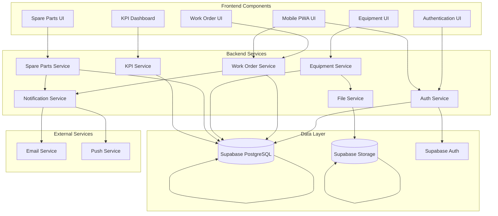
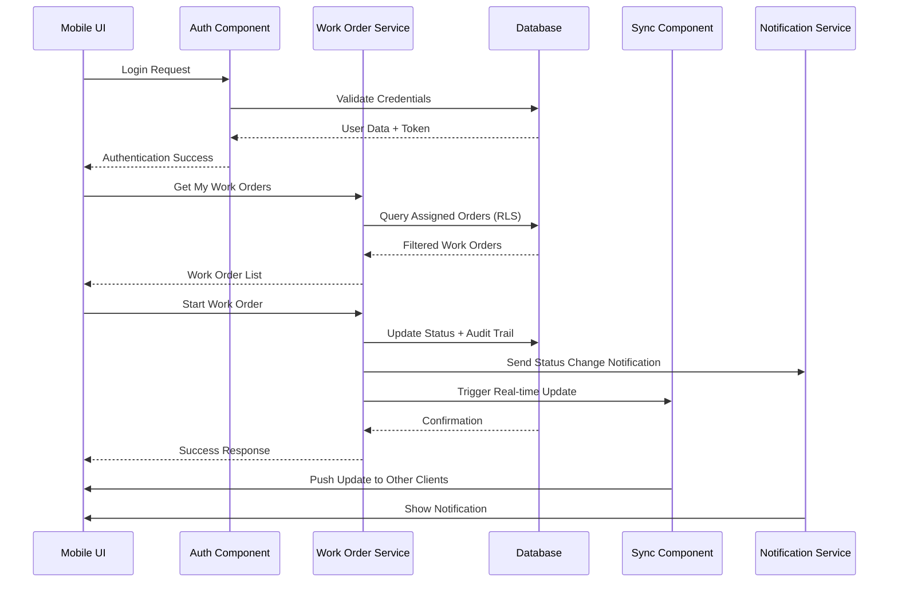

# Components

Based on the architectural patterns, tech stack, and data models, these components represent the major logical units that will be implemented across both frontend and backend. Each component has clear boundaries, responsibilities, and interfaces.

## Authentication Component

**Responsibility:** Manages user authentication, authorization, and session management across the application with role-based access control enforcement.

**Key Interfaces:**
- `login(email, password)` - Authenticate user and return JWT tokens
- `refreshToken(refreshToken)` - Generate new access token
- `logout()` - Clear user session and invalidate tokens
- `getCurrentUser()` - Retrieve authenticated user profile
- `hasRole(role)` - Check user permissions for specific roles
- `canAccess(resource, action)` - Verify user has required permissions

**Dependencies:** Supabase Auth, JWT service, User database model
**Technology Stack:** Supabase Auth SDK, React Context API, Express middleware

## Work Order Management Component

**Responsibility:** Core business logic for work order lifecycle management, including creation, assignment, status transitions, and audit trail maintenance.

**Key Interfaces:**
- `createWorkOrder(data)` - Create new work order with validation
- `assignWorkOrder(id, operatorId)` - Assign work order to operator
- `updateStatus(id, status, reason)` - Change work order status with audit
- `startWorkOrder(id)` - Mark work order as in execution
- `completeWorkOrder(id, partsUsed, duration)` - Complete work with parts tracking
- `getMyWorkOrders(operatorId)` - Retrieve operator's assigned work orders
- `getAllWorkOrders(filters)` - Get work orders with filtering (supervisors)

**Dependencies:** User component, Equipment component, Spare Parts component, Audit Trail component
**Technology Stack:** Express.js routes, Supabase queries, React state management, WebSocket polling

## Equipment Hierarchy Component

**Responsibility:** Manage flexible hierarchical equipment structure, support bulk import operations, and maintain equipment relationships and associations.

**Key Interfaces:**
- `getEquipmentHierarchy(parentId)` - Retrieve equipment tree structure
- `createEquipment(data)` - Add new equipment to hierarchy
- `updateEquipment(id, data)` - Modify equipment details
- `importEquipmentHierarchy(file)` - Bulk import from CSV/Excel
- `getEquipmentByType(type)` - Filter equipment by classification
- `getAssociatedSpareParts(equipmentId)` - Get commonly used parts for equipment
- `exportHierarchyTemplate()` - Download import template

**Dependencies:** File Storage component, Spare Parts component, Validation component
**Technology Stack:** Supabase recursive queries, CSV parsing library, React Tree components

## Spare Parts Inventory Component

**Responsibility:** Inventory management for spare parts including stock tracking, low stock alerts, usage recording, and cost tracking.

**Key Interfaces:**
- `getSpareParts(filters)` - Retrieve inventory with filtering options
- `updateStock(partId, quantity, operation)` - Adjust stock levels
- `recordUsage(workOrderId, parts)` - Log parts used in work order
- `getLowStockItems()` - Identify parts below minimum threshold
- `createSparePart(data)` - Add new spare part to inventory
- `getUsageHistory(partId, dateRange)` - Analyze consumption patterns
- `calculateInventoryValue()` - Total value of current stock

**Dependencies:** Work Order component, Notification component, Audit Trail component
**Technology Stack:** Supabase transactions, React tables, Real-time subscriptions

## Real-time Synchronization Component

**Responsibility:** Keep all connected clients synchronized with work order status changes using polling-based approach with conflict resolution.

**Key Interfaces:**
- `startPolling(interval)` - Begin periodic status checks
- `stopPolling()` - Pause synchronization
- `subscribeToUpdates(callback)` - Register update handlers
- `handleConflicts(local, remote)` - Resolve concurrent modifications
- `forceSync()` - Immediate synchronization request
- `getLastSyncTimestamp()` - Track synchronization state

**Dependencies:** Work Order component, Cache component, Network Status component
**Technology Stack:** JavaScript setInterval, Service Worker, React useEffect hooks

## KPI Analytics Component

**Responsibility:** Calculate and display maintenance performance metrics including MTTR, MTBF, equipment availability, and work order statistics.

**Key Interfaces:**
- `calculateMTTR(equipmentId, dateRange)` - Mean Time To Repair calculation
- `calculateMTBF(equipmentId, dateRange)` - Mean Time Between Failures
- `calculateAvailability(equipmentId, dateRange)` - Equipment uptime percentage
- `getWorkOrderStats(dateRange, filters)` - Work order completion metrics
- `getTopFailureModes(dateRange)` - Most common failure patterns
- `generateReport(type, parameters)` - Create analytical reports

**Dependencies:** Work Order component, Equipment component, Time Range component
**Technology Stack:** SQL aggregate queries, Chart.js library, React data visualization

## User Management Component

**Responsibility:** User account administration including role assignments, permission management, and user profile maintenance.

**Key Interfaces:**
- `createUser(userData)` - Add new user account
- `updateUserRole(userId, role)` - Modify user permissions
- `deactivateUser(userId)` - Disable user access
- `getUserProfile(userId)` - Retrieve user details
- `updateUserPreferences(userId, preferences)` - Modify user settings
- `resetPassword(userId)` - Initiate password reset process

**Dependencies:** Authentication component, Notification component
**Technology Stack:** Supabase Auth Admin API, React forms, Email service integration

## File Upload Component

**Responsibility:** Handle file uploads for equipment hierarchy import, work order attachments, and document management with validation and security scanning.

**Key Interfaces:**
- `uploadFile(file, type, metadata)` - Upload and validate files
- `validateFileFormat(file, allowedTypes)` - Check file specifications
- `processCSVUpload(file)` - Parse and validate CSV data
- `processExcelUpload(file)` - Parse Excel spreadsheets
- `generateUploadUrl(type)` - Create secure upload endpoints
- `deleteFile(fileId)` - Remove uploaded files

**Dependencies:** Equipment component, Work Order component, Security component
**Technology Stack:** Supabase Storage, Multer middleware, File validation libraries

## Notification Component

**Responsibility:** Manage user notifications for work order assignments, low stock alerts, and system events with multiple delivery channels.

**Key Interfaces:**
- `sendNotification(userId, message, type)` - Deliver immediate notifications
- `createAlert(rule, conditions)` - Set up automated alerts
- `getNotificationHistory(userId)` - Retrieve notification log
- `markAsRead(notificationId)` - Update notification status
- `subscribeToAlerts(userId, alertTypes)` - Configure alert preferences
- `sendLowStockAlert(partId, currentStock)` - Inventory threshold notifications

**Dependencies:** User component, Spare Parts component, Work Order component
**Technology Stack:** Email service, Push notifications, React toast components

## Mobile PWA Component

**Responsibility:** Progressive Web App functionality including offline capabilities, service worker management, and mobile-specific features.

**Key Interfaces:**
- `installPWA()` - Prompt for PWA installation
- `cacheData(data, key)` - Store data for offline access
- `syncWhenOnline()` - Queue changes for later synchronization
- `checkConnectivity()` - Monitor network status
- `requestCameraAccess()` - Initialize photo capture capabilities
- `enablePushNotifications()` - Set up mobile notifications

**Dependencies:** Real-time Sync component, Work Order component, Camera component
**Technology Stack:** Service Worker API, IndexedDB, PWA manifest, React PWA hooks

## Component Diagrams

---
