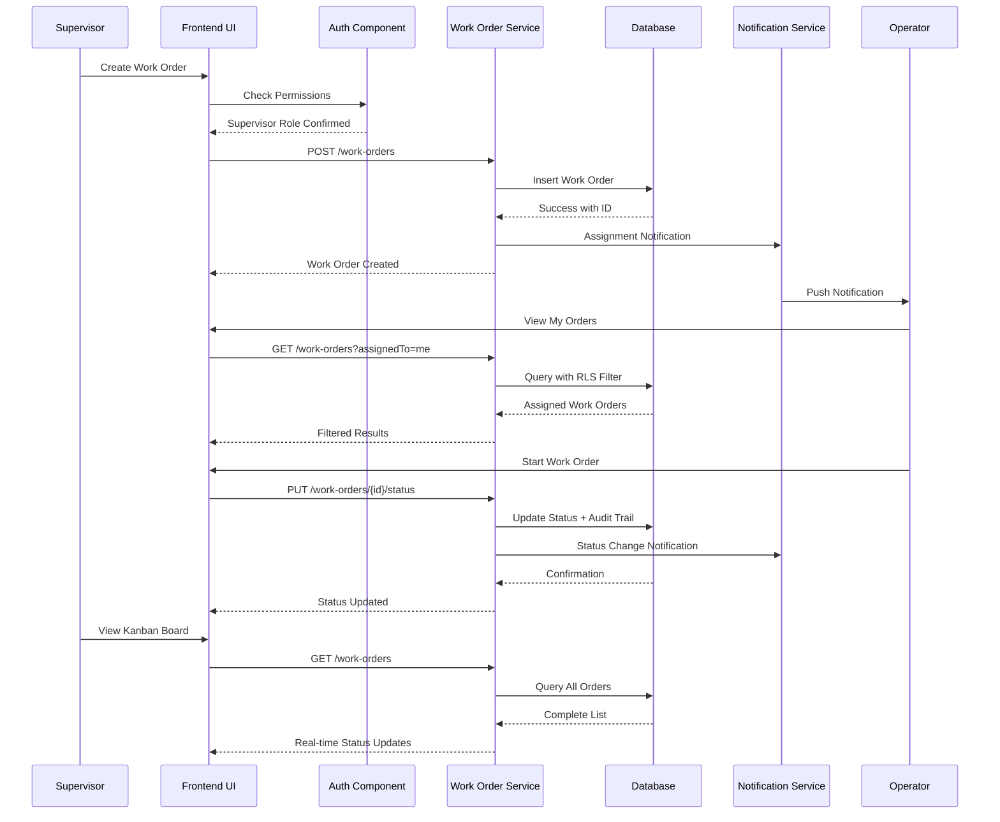
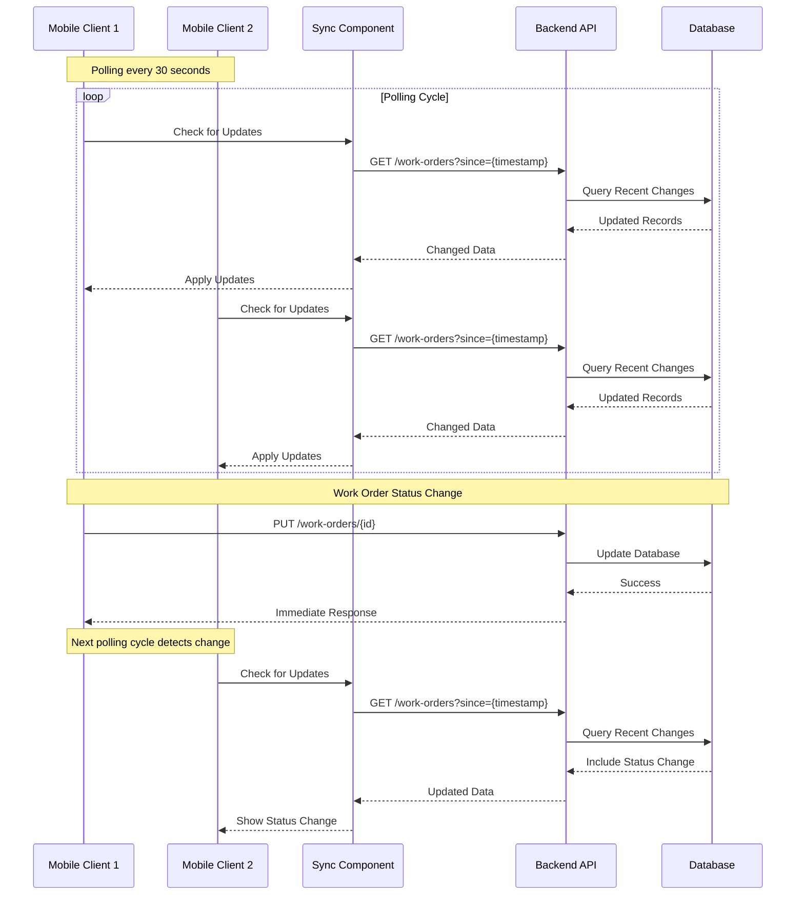
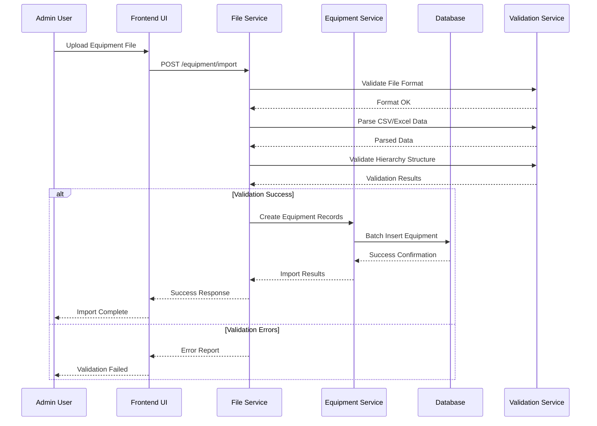
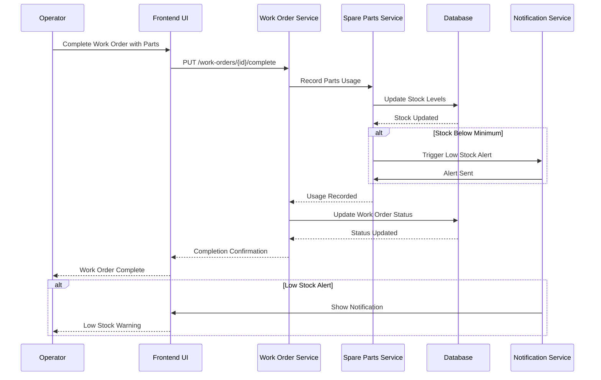

# Core Workflows

Key system workflows showing component interactions including real-time features and error handling paths.

## Work Order Lifecycle Workflow

## Real-time Synchronization Workflow

## Equipment Import Workflow

## Spare Parts Management Workflow

---
