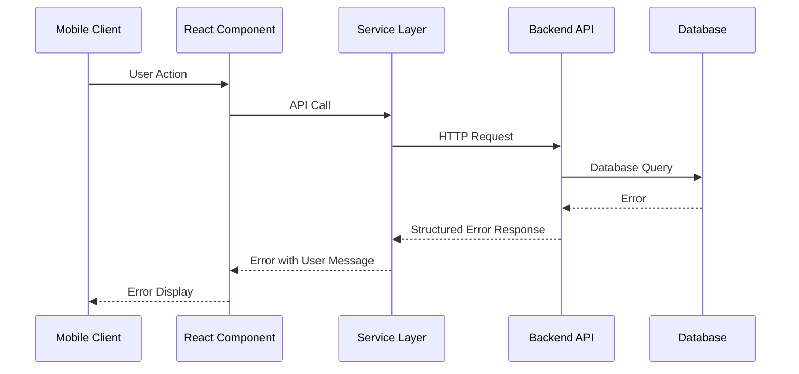

# Error Handling Strategy

## Error Flow


## Error Response Format
```typescript
interface ApiError {
  error: {
    code: string;
    message: string;
    details?: Record<string, any>;
    timestamp: string;
    requestId: string;
  };
}
```

## Frontend Error Handling
```typescript
import { toast } from 'react-hot-toast';

export class ApiClient {
  async request<T>(endpoint: string, options?: RequestInit): Promise<T> {
    try {
      const response = await fetch(`/api/v1${endpoint}`, options);

      if (!response.ok) {
        const error = await response.json();
        throw new Error(error.error?.message || 'Request failed');
      }

      return response.json();
    } catch (error) {
      // Log error for debugging
      console.error('API Error:', error);

      // Show user-friendly message
      if (error instanceof Error) {
        toast.error(error.message);
      } else {
        toast.error('An unexpected error occurred');
      }

      throw error;
    }
  }
}
```

## Backend Error Handling
```typescript
export const errorHandler = (
  error: Error,
  req: Request,
  res: Response,
  next: NextFunction
) => {
  // Log error with context
  logger.error('API Error', {
    error: error.message,
    stack: error.stack,
    url: req.url,
    method: req.method,
    userId: req.auth?.userId,
    requestId: req.id,
  });

  // Send structured error response
  const statusCode = getStatusCode(error);
  const errorResponse = {
    success: false,
    error: {
      code: getErrorCode(error),
      message: getErrorMessage(error),
      timestamp: new Date().toISOString(),
      requestId: req.id,
    },
  };

  res.status(statusCode).json(errorResponse);
};
```

---
