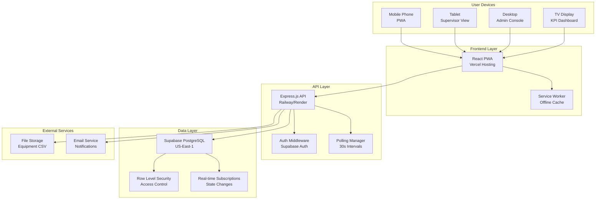

# High Level Architecture

## Technical Summary

GMAOapp implements a mobile-first Progressive Web App (PWA) architecture using React for cross-platform device compatibility, supported by a Node.js Express monolith backend and Supabase PostgreSQL database with real-time subscriptions. The system uses polling-based real-time updates (30-second intervals) to synchronize work order status across 4-8 concurrent operators, with Row Level Security ensuring data access boundaries. This architecture prioritizes rapid MVP development within 2-4 weeks while maintaining the industrial-grade reliability required for maintenance operations, all deployed on cost-effective free-tier hosting platforms (Vercel + Railway/Render + Supabase).

## Platform and Infrastructure Choice

**Platform:** Vercel + Railway/Render + Supabase Stack
**Key Services:** Vercel (frontend hosting), Railway/Render (backend API), Supabase (database + auth + real-time)
**Deployment Host and Regions:** US-East-1 (primary), with global CDN distribution via Vercel Edge Network

**Platform Decision Rationale:**
- **Vercel**: Excellent PWA support, automatic HTTPS, global CDN, and seamless GitHub integration for frontend
- **Railway/Render**: Simple Node.js deployment with free tier sufficient for 4-8 users, easy environment management
- **Supabase**: Built-in Row Level Security, real-time subscriptions, authentication, and PostgreSQL database
- **Cost Efficiency**: All services offer generous free tiers covering MVP usage requirements
- **Developer Experience**: Modern tooling with excellent TypeScript support across the stack

## Repository Structure

**Structure:** Monorepo with shared packages
**Monorepo Tool:** npm workspaces (simplicity for 2-4 week timeline)
**Package Organization:** apps/ (frontend & backend), packages/ (shared types/utils)

**Rationale for Monorepo:**
- Simplified dependency management across frontend/backend
- Shared TypeScript types for work orders, equipment, and user data
- Single deployment pipeline reduces complexity for small team
- Easy code sharing between React components and API interfaces

## High Level Architecture Diagram

## Architectural Patterns

- **Mobile-First PWA:** Progressive Web App with offline capabilities for industrial environments
- **Monolithic Backend:** Single Express.js service for rapid MVP development and simplified deployment
- **Row Level Security:** Database-level access control ensuring operators only see assigned work orders
- **Polling-Based Real-Time:** 30-second interval polling instead of WebSockets for simplicity and reliability
- **Repository Pattern:** Abstracted data access layers for future database migration flexibility
- **State Management Pattern:** Centralized React state with optimistic updates for responsive UI
- **Component-Based Architecture:** Reusable React components with TypeScript interfaces
- **API Gateway Pattern:** Single Express API endpoint with internal route organization

---
