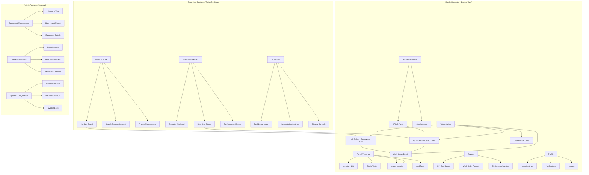
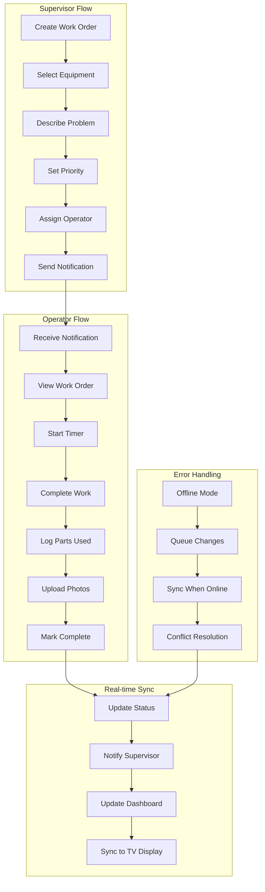
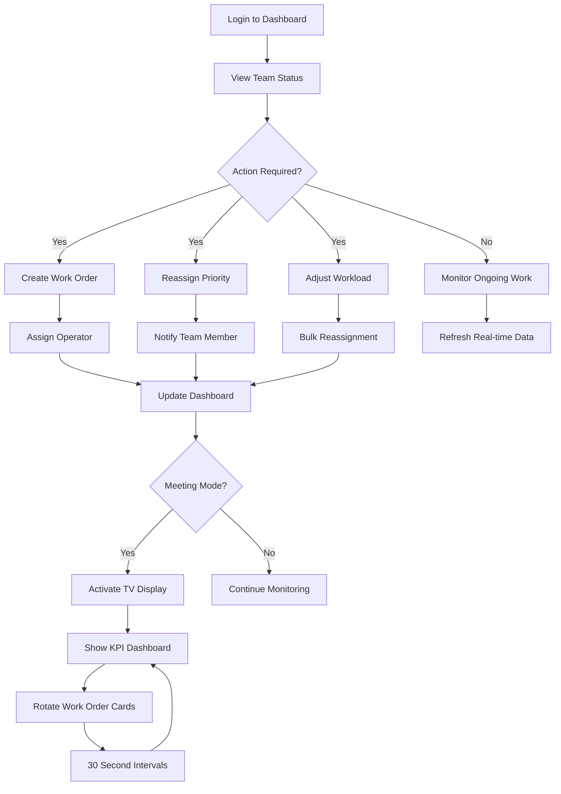
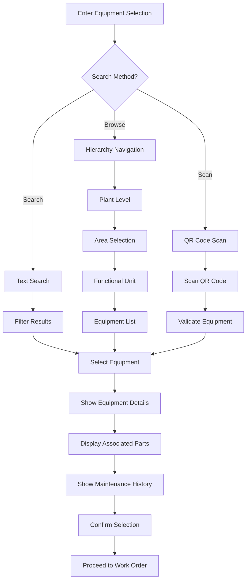
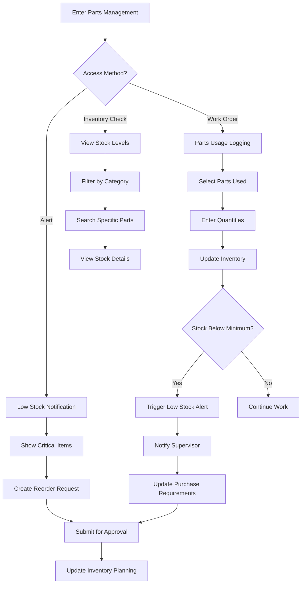

# GMAOapp UI/UX Specification

## Introduction

This document defines the user experience goals, information architecture, user flows, and visual design specifications for **GMAOapp**'s user interface. It serves as the foundation for visual design and frontend development, ensuring a cohesive and user-centered experience for industrial maintenance teams transitioning from spreadsheet-based work order management to a modern mobile-first system.

### Overall UX Goals & Principles

#### Target User Personas

**Field Operator "Maria":**
- Works on noisy factory floor wearing work gloves
- Uses mobile phone in dirty, intermittent WiFi environments
- Needs quick access to assigned work orders and parts logging
- Prioritizes speed and reliability over advanced features
- Works with 48x48px minimum touch targets for gloved operation

**Maintenance Supervisor "James":**
- Splits time between office planning and floor supervision
- Uses tablet for mobile oversight and desktop for administrative tasks
- Manages work assignment, priority adjustments, and team coordination
- Needs visibility into team workload and KPIs
- Utilizes TV display mode for team meetings

**System Administrator "Priya":**
- Primarily desktop-based with technical background
- Responsible for initial system setup and ongoing configuration
- Manages user accounts, equipment hierarchy, and spare parts inventory
- Handles bulk data operations and system maintenance
- Conducts user training and documentation

#### Usability Goals

- **Field Task Completion:** Operators can start assigned work orders in under 60 seconds from opening app
- **Supervisor Planning:** Supervisors can create and assign work orders in under 2 minutes
- **Admin Efficiency:** System administrators can complete initial setup in under 30 minutes
- **Error Prevention:** Maintain data entry error rate under 5% through clear validation
- **Offline Reliability:** All critical functions work without connectivity and sync automatically
- **One-Handed Operation:** All critical actions reachable with thumb on mobile devices

#### Design Principles

1. **Industrial-First Design** - Built for work gloves, noisy environments, and dirty screens
2. **Offline-First Reliability** - Works without connectivity, syncs automatically when available
3. **At-a-Glance Clarity** - Critical information visible from across factory floor
4. **One-Handed Operation** - All critical actions reachable with thumb on mobile devices
5. **Error-Tolerant Workflow** - Clear validation and confirmation for destructive actions

### Change Log

| Date | Version | Description | Author |
|------|---------|-------------|--------|
| 2025-11-07 | v1.0 | Initial UX specification document | Sally (UX Expert) |
| 2025-11-07 | v1.1 | Removed camera and QR code scanning from MVP scope | Sally (UX Expert) |

---

## Information Architecture (IA)

### Site Map / Screen Inventory



### Navigation Structure

**Mobile Navigation (Bottom Tab - 5 items max):**
- **Home** - KPI dashboard, alerts, quick actions (thumb-friendly, one-handed)
- **Work Orders** - Role-based view ("My Orders" for operators, "All Orders" for supervisors)
- **Parts** - Inventory management, stock alerts, usage logging with large touch targets
- **Reports** - Essential KPIs and basic reports optimized for mobile viewing
- **Profile** - Settings, notifications, user preferences with easy logout access

**Tablet Navigation (Side Navigation - Expandable):**
- **Core Operations:** Home, Work Orders, Equipment, Parts, Reports
- **Management Tools:** Team Management, Meeting Mode Kanban, TV Display Control
- **Quick Actions:** Create Work Order, Assign Tasks, Emergency Alerts
- **Administration:** User Management, System Settings (role-restricted)

**Desktop Navigation (Top + Sidebar):**
- **Primary Navigation:** File, Work Orders, Equipment, Parts, Reports, Admin, Help
- **Sidebar Tools:** Quick access to frequent operations, filters, and bulk actions
- **Contextual Menus:** Right-click options, keyboard shortcuts for power users
- **Multi-window Support:** Split-screen capabilities for complex workflows

**Breadcrumb Strategy:**
- Mobile: Minimal breadcrumbs ("Home > Work Orders > Fix Conveyor Belt")
- Tablet: Full breadcrumb trail with quick navigation back
- Desktop: Comprehensive breadcrumb with dropdown menus for each level
- Consistent pattern: Always show current location and provide clear navigation path

---

## User Flows

### Work Order Lifecycle Flow

**User Goal:** Complete maintenance work from creation through completion with real-time status visibility

**Entry Points:** Supervisor creates work order OR Automatic trigger from equipment failure

**Success Criteria:** Work completed correctly, parts tracked, status updated, team informed

#### Flow Diagram



#### Edge Cases & Error Handling

**Connectivity Issues:**
- Offline queueing with automatic sync when connection restored
- Conflict resolution for simultaneous edits
- Graceful degradation of real-time features
- Clear indication of sync status and queued changes

**Data Validation Errors:**
- Real-time validation with immediate feedback
- Smart suggestions for common errors (parts, equipment, operators)
- Prevent submission of incomplete or invalid data
- Clear error messages with actionable resolution steps

**Equipment & Parts Issues:**
- Alert when parts stock insufficient
- Suggest alternative parts or equipment
- Block work order if safety permits expired
- Provide escalation paths for exceptional circumstances

#### Notes

**Time Optimization Targets:**
- Work order creation: < 90 seconds
- Work assignment: < 30 seconds
- Work initiation: < 60 seconds
- Work completion: < 45 seconds

**Mobile-First Considerations:**
- All primary actions accessible with one hand
- Large touch targets (48x48px minimum) for work gloves
- High contrast interface for visibility in industrial environments
- Offline capability for intermittent connectivity

### Supervisor Dashboard Flow

**User Goal:** Monitor team workload, assign work, and manage priorities in real-time

**Entry Points:** Login, work order notification, TV display activation

**Success Criteria:** Team workload balanced, priorities managed, real-time visibility maintained

#### Flow Diagram



#### Edge Cases & Error Handling

**Team Unavailability:**
- Alert when all operators busy
- Suggest work order prioritization
- Provide options for external contractors or delayed scheduling
- Clear indication of expected wait times

**Priority Conflicts:**
- Alert when multiple critical work orders conflict
- Suggest optimal assignment based on skills and availability
- Provide escalation paths for management approval
- Track priority change history and reasons

**Meeting Mode Issues:**
- Graceful fallback if TV display unavailable
- Alternative screen sharing options
- Cached dashboard for offline meetings
- Clear indicators of display connection status

#### Notes

**Supervisor-Specific Features:**
- Workload balancing algorithms
- Skills-based operator assignment
- Real-time team location and status tracking
- Meeting mode with drag-and-drop work order management

**Multi-Device Support:**
- Desktop for planning and bulk operations
- Tablet for floor monitoring and quick adjustments
- Mobile for urgent notifications and basic management

### Equipment Hierarchy Navigation Flow

**User Goal:** Navigate complex equipment structure to select correct assets for work orders

**Entry Points:** Work order creation, equipment management, maintenance planning

**Success Criteria:** Correct equipment identified quickly, context information available

#### Flow Diagram



#### Edge Cases & Error Handling

**Equipment Not Found:**
- Suggest similar equipment names or codes
- Provide option to create new equipment (admin only)
- Display recently used equipment for quick access
- Contact supervisor for equipment creation requests

**Hierarchy Confusion:**
- Visual breadcrumbs showing current location in hierarchy
- Expandable/collapsible tree structure for complex hierarchies
- Search within specific hierarchy levels
- Favorite equipment for quick access

**QR Code Scanning Removed:**
- QR code functionality removed from MVP scope
- Equipment selection via text search and hierarchy navigation only
- Manual equipment code entry as primary identification method

#### Notes

**Hierarchy Features:**
- Flexible structure supporting Plant → Area → Functional Unit → Equipment → Components
- Bulk import/export functionality for initial setup and ongoing maintenance
- Search across all hierarchy levels with filters
- Visual tree representation with expand/collapse functionality

**Mobile Optimization:**
- Progressive disclosure of hierarchy levels
- Quick access to frequently used equipment
- Offline caching of equipment data
- Large touch targets for equipment selection

### Spare Parts Management Flow

**User Goal:** Monitor inventory, log parts usage, and manage stock alerts

**Entry Points:** Work order completion, inventory check, low stock alert

**Success Criteria:** Inventory accurately tracked, low stock prevented, usage recorded

#### Flow Diagram



#### Edge Cases & Error Handling

**Insufficient Stock:**
- Alert before allowing usage if stock insufficient
- Suggest alternative parts with same specifications
- Provide backorder option with expected delivery dates
- Supervisor override for emergency situations

**Data Entry Errors:**
- Real-time validation of quantities and part numbers
- Auto-suggestions for commonly used parts
- Barcode scanning integration for accurate identification
- Undo functionality for incorrect entries

**Sync Conflicts:**
- Handle simultaneous inventory updates from multiple work orders
- FIFO (First In, First Out) tracking for batch management
- Audit trail for all inventory changes
- Reconciliation tools for inventory discrepancies

#### Notes

**Inventory Features:**
- Real-time stock level tracking
- Automatic low stock alerts with configurable thresholds
- Usage history and trend analysis
- Cost tracking and budget management

**Integration Points:**
- Automatic parts association with equipment
- Predictive parts suggestions based on historical usage
- Purchase order integration for reorder management
- Supplier information and lead time tracking

---

## Wireframes & Mockups

### Design Tools & Approach

**Primary Design Tool:** Figma (recommended for collaborative design and developer handoff)
**Alternative Tools:** Google Stitch, Figma Make for rapid prototyping
**Design System:** Custom industrial-focused design system optimized for factory environments

**Design Philosophy:**
- Mobile-first responsive design
- Large touch targets (56x56px minimum) for work gloves
- High contrast interface (7:1 ratio) for factory visibility
- One-handed operation optimization
- Offline-first interaction patterns

### AI Design Prompts for All Screens

#### **1. Login Screen (375x812px - Mobile)**
```
Industrial maintenance app login screen with:
- Simple, professional design with "GMAOapp" branding
- Large input fields for email and password (56px height) with clear labels
- "Forgot password" and "Remember me" options
- Prominent login button with industrial blue color (#0EA5E9)
- Role selection提示: Operator, Supervisor, Admin
- High contrast text for readability in various lighting conditions
- Error message area for invalid credentials
- Clean, trustworthy design emphasizing security and reliability
- Loading state indicator during authentication
```

#### **2. Mobile Dashboard (375x812px)**
```
Industrial maintenance mobile app dashboard for factory workers. Mobile screen featuring:

- Top header with app name "GMAOapp", notifications bell, and user profile icon
- Large KPI cards in 2x2 grid showing: Active Orders (3), Critical Alerts (2), Equipment Uptime (89%), Team Status
- Color-coded status indicators: green (good), yellow (warning), red (critical)
- Recent work orders list with priority badges and quick action buttons
- Floating action button (+) for creating new work orders
- Bottom tab navigation with icons: Home, Work Orders, Parts, Reports, Profile
- Blue (#0EA5E9) and gray color scheme with high contrast
- Large buttons and text suitable for work gloves
- Pull-to-refresh indicator for manual sync
```

#### **3. Work Orders List (375x812px)**
```
Mobile work orders list screen for maintenance operators showing:

- Header with search bar and filter options (Priority, Status, Equipment)
- Work order cards with large touch areas (56px minimum height)
- Each card displaying: Priority badge (color+icon+text), Equipment name, Brief description, Assignment status
- Status indicators: Open (blue), In Progress (yellow), Completed (green), Critical (red)
- Quick action buttons on each card: "Start", "View Details", "Report Issue"
- Swipe gestures for quick actions (left to start, right to view)
- Bottom filter chips: "All", "My Orders", "High Priority", "Overdue"
- Empty state with helpful illustration and "Create First Work Order" CTA
```

#### **4. Work Order Detail (375x812px)**
```
Detailed work order screen for operator performing maintenance work:

- Header with equipment name, priority badge, and status indicator
- Large timer display showing elapsed time "00:23:45"
- Equipment information panel with manual equipment code entry
- Work instructions section with clear, readable text
- Parts checklist with current stock levels
- Large action buttons: "START WORK" (56x56px blue), "PAUSE", "COMPLETE"
- No photo attachments (removed from MVP scope)
- Notes section for operator comments
- Safety warnings prominently displayed
- Emergency stop button (red) always accessible
- Progress indicator showing current workflow stage
```

#### **5. Parts Inventory (375x812px)**
```
Mobile spare parts inventory management screen for maintenance operators:

- Search bar with barcode scanner icon and voice search option
- Parts list with large touch-friendly rows (56px height)
- Each part showing: Part name, Current stock/Minimum stock, Location, Status icon
- Color-coded stock levels: Green (20+), Yellow (5-19), Red (1-4), Critical (0)
- Quick action buttons: "Use Part", "View Details", "Find Location"
- Filter chips: "All Parts", "Low Stock", "Frequently Used", "By Category"
- Floating action button for adding new parts
- Stock alert banner for critical items
- Parts usage history button
```

#### **6. Parts Usage Form (375x812px)**
```
Parts logging form for work order completion:

- Header showing work order number and equipment name
- Searchable parts list with autocomplete
- Parts selection showing: Part name, Available stock, Unit cost
- Quantity input with large +/- buttons and stepper (+1, +5, +10)
- Real-time stock validation with warnings for insufficient inventory
- Running cost calculation and parts summary
- Alternative part suggestions if selected part unavailable
- "Add Another Part" button for multiple items
- Save and continue button with confirmation dialog
- Offline indicator showing queued changes
```

#### **7. Equipment Hierarchy (375x812px)**
```
Equipment hierarchy navigation screen for maintenance planning:

- Search bar with equipment code and name search
- Expandable tree structure: Plant > Area > Functional Unit > Equipment > Components
- Visual hierarchy with indentation and icons for each level
- Equipment cards showing: Name, Status, Location, Associated parts count
- Quick actions: "Create Work Order", "View Details", "View History"
- Breadcrumb navigation showing current location in hierarchy
- Recently used equipment section for quick access
- Filter options by equipment type and status
- Manual equipment code entry for quick equipment identification
```

#### **8. Reports Dashboard (375x812px)**
```
Mobile reports screen showing maintenance analytics:

- Date range selector with quick options (Today, Week, Month)
- Key metrics cards: Work completed, Average repair time, Parts used, Team productivity
- Simple charts showing: Work order trends by day, Priority distribution, Equipment performance
- Team performance summary with completion rates
- Equipment reliability metrics
- Export button for PDF reports
- Filter options by team member, equipment, time period
- Comparison to previous period indicators
- Share report button for email distribution
```

#### **9. Supervisor Tablet Dashboard (1024x768px)**
```
Tablet dashboard for maintenance supervisors with team oversight:

- Top toolbar with user info, notifications, and date/time
- KPI summary row: Active orders, Team status, Critical alerts, Performance metrics
- Team workload section showing each operator's current assignments
- Work order priority matrix (Urgent vs Important)
- Equipment status overview with health indicators
- Quick action buttons: "Create Work Order", "Assign Team", "Generate Report"
- Real-time status updates with visual indicators
- Meeting mode toggle to activate TV display
- Team availability and skills matrix
- Drag-and-drop area for quick work order reassignment
```

#### **10. Supervisor Kanban Board (1024x768px)**
```
Kanban board interface for maintenance supervisors with drag-and-drop functionality:

- Three main columns: "To Do", "In Progress", "Completed"
- Work order cards with priority color coding and operator avatars
- Card details showing: Equipment name, Priority, Time tracking, Parts needed
- Drag-and-drop capability between columns
- Filter panel by team member, priority, equipment type, date range
- Bulk selection mode for multiple work order operations
- Column statistics showing work distribution
- Quick actions menu on each card: Reassign, Change priority, Add notes
- Real-time updates showing other supervisors' changes
- Zoom controls for better visibility in meeting rooms
```

#### **11. Equipment Management Desktop (1920x1080px)**
```
Desktop equipment management interface for system administrators:

- Complex multi-column layout with resizable panels
- Equipment hierarchy tree on the left with drag-and-drop reorganization
- Main content area showing equipment details and associated work orders
- Bulk import/export toolbar with CSV/Excel upload buttons
- Advanced filtering and search capabilities
- Equipment health monitoring dashboard
- Maintenance scheduling calendar
- Parts association matrix showing commonly used parts per equipment
- Audit log of equipment changes and history
- Performance analytics with charts and trends
- Multi-select for bulk operations
```

#### **12. TV Display Dashboard (1920x1080px)**
```
Large screen display for factory meeting rooms showing maintenance overview:

- Auto-rotating dashboard switching between views every 30 seconds
- View 1: KPI Dashboard - MTTR, MTBF, Equipment availability, Team productivity
- View 2: Work Order Status - Active orders by priority and assignment
- View 3: Team Performance - Individual metrics and achievements
- View 4: Equipment Health - Overall equipment status and alerts
- Large, readable fonts visible from across meeting room
- High contrast design with clear visual hierarchy
- Current time and last update timestamp
- Company branding in subtle header
- Progress indicators for team goals
- Emergency alerts displayed prominently at top
```

#### **13. User Profile & Settings (375x812px)**
```
User profile management screen for all user roles:

- Profile header with user photo, name, role, and department
- Settings sections: Account, Notifications, Preferences, About
- Account settings: Email, phone number, password change
- Notification preferences: Work assignments, Stock alerts, System updates
- App preferences: Language, Theme (light/dark), Units (metric/imperial)
- Accessibility settings: Text size, High contrast mode
- Sign out button with confirmation
- Support section with help documentation and contact info
- App version and build information
- Data usage and storage information
```

#### **14. Admin User Management (1920x1080px)**
```
Desktop user administration interface for system administrators:

- User table with advanced filtering and search capabilities
- Columns: Name, Email, Role, Department, Status, Last login, Actions
- Bulk operations: Activate/Deactivate, Role changes, Password reset
- User creation form with role assignment and permissions
- Activity logs showing user actions and system changes
- Export user list functionality
- Permission matrix showing role-based access rights
- User statistics: Active users, Login frequency, Role distribution
- Import users from CSV functionality
- Audit trail for compliance and security
```

### Component Design Specifications

#### **Button Design System**
```
Primary Button (Main actions):
- Size: 56x56px minimum for work gloves
- Background: #0EA5E9 (Safety blue)
- Text: White, 16px, Inter Medium font
- Border radius: 8px
- Touch feedback: Scale animation + haptic vibration
- States: Default (100% opacity), Pressed (80%), Disabled (40%)

Secondary Button:
- Size: 48x48px minimum
- Background: Transparent, 2px blue border
- Text: #0EA5E9, 16px, Inter Regular
- Hover: Light blue background

Emergency Button:
- Size: 64x64px (larger for emergencies)
- Background: #DC2626 (Safety red)
- Text: White, 18px, Inter Bold
- Animation: Pulse effect for attention
- 3px white border for emphasis
```

#### **Input Field Design**
```
Standard Text Input:
- Height: 56px for touch accessibility
- Border: 2px, #E5E7EB with focus state blue
- Background: White for high contrast
- Text: 16px, Inter Regular, #1F2937
- Label: 14px, Inter Medium, #374151
- Error state: Red border with error message below

Number Input (Parts Quantity):
- Large increment/decrement buttons: 24x24px
- Step options: +1, +5, +10 for bulk adjustments
- Real-time validation against available stock
- Clear display of current stock level

Search Input:
- Icon on left for visual clarity
- Clear button on right when text entered
- Auto-complete suggestions dropdown
- Voice search option for hands-free operation
```

### Design Handoff Guidelines

#### **Figma Developer Handoff**
- Export all components with CSS properties
- Provide design tokens for colors, typography, spacing
- Include responsive behavior specifications
- Document animation and interaction patterns
- Export assets in 2x, 3x resolutions for high-DPI screens

#### **Asset Requirements**
- Icons: SVG format for scalability
- Images: WebP format with fallbacks
- Typography: Inter font family from Google Fonts
- Colors: Hex codes with accessibility contrast ratios

#### **Responsive Breakpoints**
- Mobile: 375px - 430px (primary design target)
- Tablet: 768px - 1024px (supervisor interface)
- Desktop: 1920px+ (administration interface)
- TV Display: 1920x1080px (meeting room display)

---

## Component Library / Design System

### Design System Approach

**Decision:** Custom industrial-focused design system optimized for maintenance environments

**Foundation:** Built on proven design patterns (Material Design principles) with industrial-specific adaptations

**Core Principles:**
- Mobile-first responsive design
- Large touch targets for work gloves (56x56px minimum)
- High contrast interface (7:1 ratio) for factory visibility
- One-handed operation optimization
- Offline-first interaction patterns
- Component composition over inheritance
- Cross-device consistency with adaptive behavior

### Design Token System

#### Color Palette
**Primary Colors (Industrial Safety Standards):**
```
Blue System (Primary Actions):
- blue-50: #EFF6FF (Light backgrounds)
- blue-100: #DBEAFE (Hover states)
- blue-500: #3B82F6 (Standard primary)
- blue-600: #0EA5E9 (GMAOapp primary)
- blue-700: #1E40AF (Pressed states)
- blue-900: #1E3A8A (Dark themes)

Green System (Success/Complete):
- green-50: #F0FDF4 (Success backgrounds)
- green-100: #DCFCE7 (Light success)
- green-500: #22C55E (Standard success)
- green-600: #10B981 (GMAOapp success)
- green-700: #15803D (Success variants)

Yellow/Orange System (Warning/In Progress):
- yellow-50: #FFFBEB (Warning backgrounds)
- yellow-100: #FEF3C7 (Light warnings)
- yellow-500: #EAB308 (Standard warning)
- yellow-600: #F59E0B (GMAOapp warning)
- orange-600: #EA580C (Urgent warnings)

Red System (Error/Critical):
- red-50: #FEF2F2 (Error backgrounds)
- red-100: #FEE2E2 (Light errors)
- red-500: #EF4444 (Standard error)
- red-600: #DC2626 (GMAOapp error/critical)
- red-700: #B91C1C (Critical variants)
```

**Semantic Colors:**
```
Status Colors:
- status-open: #3B82F6 (Work orders ready)
- status-progress: #F59E0B (Work in progress)
- status-complete: #10B981 (Successfully completed)
- status-rejected: #DC2626 (Rejected/cancelled)

Priority Colors:
- priority-critical: #DC2626 (Immediate attention)
- priority-high: #F59E0B (High priority)
- priority-medium: #3B82F6 (Normal priority)
- priority-low: #10B981 (Low priority)

Stock Levels:
- stock-critical: #DC2626 (Out of stock)
- stock-low: #F59E0B (Reorder soon)
- stock-normal: #10B981 (Adequate supply)
- stock-good: #059669 (Well stocked)
```

#### Typography System
**Font Families:**
- **Primary:** Inter (system-ui, -apple-system, sans-serif)
- **Monospace:** JetBrains Mono (Fira Code, monospace)

**Type Scale:**
```
Mobile (Responsive Scale):
- text-xs: 11px (Caption, metadata)
- text-sm: 13px (Secondary text)
- text-base: 15px (Body text)
- text-lg: 17px (Large body)
- text-xl: 18px (Small headings)
- text-2xl: 20px (Section headings)
- text-3xl: 24px (Page headings)
- text-4xl: 28px (Feature headings)

Desktop (Enhanced Scale):
- text-xs: 12px (Caption, metadata)
- text-sm: 14px (Secondary text)
- text-base: 16px (Body text)
- text-lg: 18px (Large body)
- text-xl: 20px (Small headings)
- text-2xl: 24px (Section headings)
- text-3xl: 30px (Page headings)
- text-4xl: 36px (Feature headings)
```

**Font Weights:**
- font-light: 300 (Display text only)
- font-normal: 400 (Body text, standard content)
- font-medium: 500 (Emphasis, UI labels)
- font-semibold: 600 (Headings, important text)
- font-bold: 700 (CTA text, critical information)

#### Spacing System
**8-Point Grid System:**
```
Base Units:
- space-0: 0px (No spacing)
- space-1: 4px (Micro spacing)
- space-2: 8px (Base unit)
- space-3: 12px (Small spacing)
- space-4: 16px (Standard spacing)
- space-6: 24px (Medium spacing)
- space-8: 32px (Large spacing)
- space-12: 48px (Component spacing)
- space-16: 64px (Section spacing)
- space-20: 80px (Page spacing)
- space-24: 96px (Major spacing)

Semantic Spacing:
- gap-component: 16px (Between components)
- gap-section: 32px (Between sections)
- gap-element: 8px (Between elements)
- padding-mobile: 16px (Mobile screen padding)
- padding-tablet: 24px (Tablet screen padding)
- padding-desktop: 32px (Desktop screen padding)

Touch Target Spacing:
- touch-target-min: 48px (Minimum touch target)
- touch-target-large: 56px (Preferred for gloves)
- touch-target-emergency: 64px (Emergency controls)
- spacing-touch: 12px (Minimum between targets)
```

### Core Components

#### Button System
**Primary Button (Main Actions):**
- Size: 56x56px minimum for work gloves
- Background: #0EA5E9 (Safety blue)
- Text: White, 16px, Inter Medium
- Border radius: 8px
- Touch feedback: Scale animation + haptic vibration
- States: Default (100% opacity), Pressed (80%), Disabled (40%)

**Secondary Button:**
- Size: 48x48px minimum
- Background: Transparent, 2px blue border
- Text: #0EA5E9, 16px, Inter Regular
- Hover: Light blue background

**Emergency Button:**
- Size: 64x64px (larger for emergencies)
- Background: #DC2626 (Safety red)
- Text: White, 18px, Inter Bold
- Animation: Pulse effect for attention
- 3px white border for emphasis

#### Input Field System
**Standard Text Input:**
- Height: 56px for touch accessibility
- Border: 2px, #E5E7EB with focus state blue
- Background: White for high contrast
- Text: 16px, Inter Regular, #1F2937
- Label: 14px, Inter Medium, #374151
- Error state: Red border with error message below

**Number Input (Parts Quantity):**
- Large increment/decrement buttons: 24x24px
- Step options: +1, +5, +10 for bulk adjustments
- Real-time validation against available stock
- Clear display of current stock level

**Search Input:**
- Icon on left for visual clarity
- Clear button on right when text entered
- Auto-complete suggestions dropdown
- Voice search option for hands-free operation

#### Status Indicators
**Priority Badges:**
- Critical: Red background, white icon + text, pulse animation
- High: Orange background, white icon + text
- Medium: Blue background, white icon + text
- Low: Green background, white icon + text

**Work Status Indicators:**
- Open: Blue circle with white center
- In Progress: Yellow circle with animated progress
- Completed: Green circle with checkmark
- Rejected: Red circle with X mark

**Stock Level Indicators:**
- Good Stock (20+): Green bar
- Low Stock (5-19): Yellow bar with warning icon
- Critical Stock (1-4): Red bar with alert icon
- Out of Stock (0): Red bar with critical alert icon

### Component Architecture

#### Component Hierarchy
```
Atomic Design Structure:
Tokens (Design System) → Primitives (Basic UI) → Components (Reusable) → Templates (Layouts) → Pages (Complete Screens)

Composition Over Inheritance:
- Small, focused components with single responsibilities
- Flexible composition patterns for complex interfaces
- Clear separation between structure and styling
- Prop-driven customization with sensible defaults
```

#### Responsive Component System
**Breakpoint System:**
- Mobile: 375px - 430px (Primary design target)
- Tablet: 768px - 1024px (Supervisor interface)
- Desktop: 1024px+ (Administration interface)
- TV Display: 1920x1080px (Meeting room display)

**Responsive Prop Pattern:**
```typescript
interface ResponsiveProps {
  size?: ResponsiveValue<'sm' | 'md' | 'lg'>
  direction?: ResponsiveValue<'row' | 'column'>
  columns?: ResponsiveValue<1 | 2 | 3 | 4>
  hideOn?: 'mobile' | 'tablet' | 'desktop'
}

// Usage Example:
<WorkOrderCard
  size={{ mobile: 'md', tablet: 'lg' }}
  direction={{ mobile: 'column', tablet: 'row' }}
  hideOn="mobile"
/>
```

#### Device-Aware Components
**Interaction Adaptation:**
- Mobile: Tap, swipe, voice commands
- Tablet: Tap, drag-drop, multi-select
- Desktop: Click, keyboard shortcuts, right-click menus

**Layout Adaptation:**
- Mobile: Single column, bottom navigation
- Tablet: Two columns, side navigation
- Desktop: Multi-column, top navigation + sidebar

**Feature Adaptation:**
- Mobile: Camera, GPS, notifications, offline mode
- Tablet: Drag-drop, multi-select, advanced filtering
- Desktop: Multi-window, bulk operations, advanced analytics

### Component Library Structure

#### MVP Priority Components
**Core Components (Week 1-2):**
1. **Button System** - Primary, Secondary, Emergency variants
2. **Input System** - Text, Number, Search, Select inputs
3. **Status Indicators** - Priority, Status, Stock badges
4. **Navigation** - Bottom tabs, side navigation, breadcrumbs
5. **Card Components** - Work Order, Equipment, Alert cards

**Composite Components (Week 2-3):**
1. **Work Order Card** - Complete work order display with actions
2. **Parts Logger** - Inventory management interface
3. **Equipment Selector** - Hierarchy navigation component
4. **KPI Widgets** - Metrics display components
5. **Form Components** - Complete form layouts with validation

**Layout Components (Week 3-4):**
1. **Screen Layouts** - Mobile, tablet, desktop adaptations
2. **Grid Systems** - Responsive grid layouts
3. **Navigation Patterns** - Cross-device navigation
4. **Modal/Dialog System** - Overlay and confirmation components
5. **Loading States** - Progressive loading and skeleton screens

#### Component Usage Guidelines
**Naming Conventions:**
- Component names: PascalCase (WorkOrderCard, StatusBadge)
- Props: camelCase (touchTargetSize, variantType)
- CSS Classes: kebab-case (work-order-card, status-badge)
- Tokens: kebab-case with semantic prefixes (color-primary-blue, spacing-component)

**Prop Interfaces:**
```typescript
// Standard Component Props
interface ComponentProps {
  // Visual variants
  variant?: 'primary' | 'secondary' | 'success' | 'warning' | 'error'
  size?: 'xs' | 'sm' | 'md' | 'lg' | 'xl'

  // State management
  disabled?: boolean
  loading?: boolean
  selected?: boolean

  // Event handlers
  onClick?: (event: React.MouseEvent) => void
  onChange?: (value: any) => void

  // Accessibility
  ariaLabel?: string
  ariaDescribedBy?: string

  // Children
  children?: React.ReactNode
}
```

### Cross-Device Consistency

#### Visual Consistency Rules
**Color Usage:**
- Primary actions ALWAYS use blue-600 (#0EA5E9)
- Success states ALWAYS use green-600 (#10B981)
- Warnings ALWAYS use yellow-600 (#F59E0B)
- Errors ALWAYS use red-600 (#DC2626)
- Neutral backgrounds ALWAYS use gray-50/gray-100

**Typography Hierarchy:**
- Page headings: text-4xl, font-bold, gray-900
- Section headings: text-2xl, font-semibold, gray-800
- Card titles: text-xl, font-medium, gray-700
- Body text: text-base, font-normal, gray-600
- Secondary text: text-sm, font-normal, gray-500
- Caption text: text-xs, font-normal, gray-400

#### Interaction Consistency Rules
**Touch Targets:**
- Primary actions: 56x56px minimum
- Secondary actions: 48x48px minimum
- Emergency controls: 64x64px minimum
- Spacing between targets: 12px minimum

**Feedback Patterns:**
- Success: Green checkmark + brief message
- Error: Red X + descriptive error + fix suggestion
- Warning: Yellow triangle + caution message
- Loading: Blue spinner + progress indication
- Empty state: Illustration + helpful message + CTA

**Animation Patterns:**
- Micro-interactions: 150ms ease-out
- Page transitions: 300ms ease-in-out
- Loading states: Gentle pulsing or spinning
- Error feedback: Brief shake + color change
- Success feedback: Brief scale + color flash

### Implementation Strategy

#### Development Phases
**Week 1: Foundation**
- Design token implementation
- Primitive components (buttons, inputs, badges)
- Basic styling and theming system
- Component testing infrastructure

**Week 2: Core Components**
- Composite components (cards, forms, navigation)
- Responsive behavior implementation
- Cross-device consistency validation
- Accessibility compliance testing

**Week 3: Advanced Components**
- Complex interactions (drag-drop, multi-select)
- Animation and micro-interactions
- Performance optimization
- Error boundary implementation

**Week 4: Integration & Testing**
- Component library documentation
- Design system website
- Cross-browser testing
- Performance benchmarking

#### Quality Assurance
**Accessibility Testing:**
- WCAG AA compliance validation
- Screen reader compatibility testing
- Keyboard navigation testing
- Color contrast verification

**Performance Testing:**
- Component render performance
- Bundle size optimization
- Memory leak detection
- Animation performance testing

**Cross-Device Testing:**
- Mobile device testing (iOS, Android)
- Tablet testing (iPad, Android tablets)
- Desktop browser testing (Chrome, Firefox, Safari)
- TV display testing (various screen sizes)

---

## Branding & Style Guide

### Visual Identity

**Brand Philosophy:** Clean, industrial aesthetic optimized for factory environments with functional beauty and purpose-driven design

**Brand Personality:**
- **Professional:** Reliable, trustworthy, enterprise-grade
- **Efficient:** Fast, purposeful, no unnecessary elements
- **Supportive:** Helpful, clear, guiding users through complex tasks
- **Robust:** Durable, dependable, works in challenging conditions

**Design Principles:**
- **Clarity over decoration:** Every element serves a purpose
- **Safety first:** Industrial safety standards inform color and interaction choices
- **Accessibility by default:** Design works for all users in all conditions
- **Consistent across devices:** Unified experience from mobile to TV displays

### Color Palette

#### Primary Brand Colors
**GMAOapp Brand Colors:**
```
Primary Blue (Safety & Action):
- brand-blue-50: #EFF6FF (Lightest backgrounds)
- brand-blue-100: #DBEAFE (Subtle highlights)
- brand-blue-500: #3B82F6 (Standard interactions)
- brand-blue-600: #0EA5E9 (GMAOapp primary brand color)
- brand-blue-700: #1E40AF (Pressed states, emphasis)
- brand-blue-900: #1E3A8A (Dark themes, strong emphasis)

Neutral Grays (Professional Foundation):
- neutral-50: #F9FAFB (Page backgrounds)
- neutral-100: #F3F4F6 (Card backgrounds)
- neutral-200: #E5E7EB (Borders, dividers)
- neutral-300: #D1D5DB (Disabled states)
- neutral-400: #9CA3AF (Placeholders, secondary text)
- neutral-500: #6B7280 (Standard text)
- neutral-600: #4B5563 (Body copy)
- neutral-700: #374151 (Headings, important text)
- neutral-800: #1F2937 (Primary text)
- neutral-900: #111827 (Critical text, emphasis)
```

#### Functional Colors (Industrial Safety Standards)
**Status & Priority Colors:**
```
Success System (Completion, Safety):
- success-50: #F0FDF4 (Success backgrounds)
- success-100: #DCFCE7 (Light success highlights)
- success-500: #22C55E (Standard success)
- success-600: #10B981 (GMAOapp success)
- success-700: #15803D (Success variants)

Warning System (Caution, In Progress):
- warning-50: #FFFBEB (Warning backgrounds)
- warning-100: #FEF3C7 (Light warning highlights)
- warning-500: #EAB308 (Standard warning)
- warning-600: #F59E0B (GMAOapp warning)
- warning-700: #CA8A04 (Warning variants)

Error System (Critical, Danger):
- error-50: #FEF2F2 (Error backgrounds)
- error-100: #FEE2E2 (Light error highlights)
- error-500: #EF4444 (Standard error)
- error-600: #DC2626 (GMAOapp error)
- error-700: #B91C1C (Error variants)

Info System (Information, Neutral):
- info-50: #EFF6FF (Info backgrounds)
- info-100: #DBEAFE (Light info highlights)
- info-500: #3B82F6 (Standard info)
- info-600: #2563EB (GMAOapp info)
- info-700: #1D4ED8 (Info variants)
```

#### Semantic Color Applications
**Work Order Status Colors:**
```
status-draft: #6B7280 (Gray - Not yet assigned)
status-open: #3B82F6 (Blue - Ready to start)
status-planned: #8B5CF6 (Purple - Scheduled)
status-in-progress: #F59E0B (Yellow - Currently working)
status-completed: #10B981 (Green - Successfully done)
status-closed: #6B7280 (Gray - Archived)
status-rejected: #EF4444 (Red - Cancelled/invalid)
status-waiting: #F59E0B (Yellow - Awaiting something)
status-pending-stock: #EF4444 (Red - Parts unavailable)
```

**Priority Level Colors:**
```
priority-critical: #DC2626 (Red - Immediate attention required)
priority-high: #F59E0B (Orange - High priority, urgent)
priority-medium: #3B82F6 (Blue - Normal priority, routine)
priority-low: #10B981 (Green - Low priority, can wait)
```

**Inventory Status Colors:**
```
stock-available: #10B981 (Green - Good stock)
stock-low: #F59E0B (Yellow - Reorder soon)
stock-critical: #DC2626 (Red - Out of stock, urgent)
stock-discontinued: #6B7280 (Gray - No longer available)
```

### Typography

#### Font System
**Primary Typeface:**
```
Font Family: Inter
- Designed for UI clarity and readability
- Excellent screen rendering at all sizes
- Strong character support for international use
- Optimized for mobile and desktop displays
- Fallback fonts: system-ui, -apple-system, sans-serif

Why Inter:
- High x-height for better readability on small screens
- Clear distinction between similar characters (0/O, 1/l)
- Excellent performance and fast loading
- Open source with extensive language support
- Designed specifically for user interfaces
```

**Monospace Typeface:**
```
Font Family: JetBrains Mono
- Clear, technical appearance for code and data
- Consistent character width for alignment
- Excellent readability of technical information
- Fallback fonts: 'Fira Code', 'SF Mono', monospace

Use Cases:
- Equipment codes and serial numbers
- Technical specifications
- Error codes and system messages
- Data displays and tables
```

#### Type Scale
**Mobile-First Responsive Typography:**
```
Mobile Scale (375px+ base):
- text-xs: 11px / 1.4 - Metadata, timestamps, fine print
- text-sm: 13px / 1.4 - Secondary text, captions, labels
- text-base: 15px / 1.5 - Body copy, standard content
- text-lg: 17px / 1.5 - Emphasized body text, subheadings
- text-xl: 18px / 1.4 - Card titles, section headings
- text-2xl: 20px / 1.3 - Page headings, important titles
- text-3xl: 24px / 1.2 - Feature headings, large displays
- text-4xl: 28px / 1.2 - Hero headings, special emphasis

Tablet Scale (768px+ enhanced):
- text-xs: 12px / 1.4 - Metadata, timestamps
- text-sm: 14px / 1.4 - Secondary text, captions
- text-base: 16px / 1.5 - Body copy, standard content
- text-lg: 18px / 1.5 - Emphasized body text
- text-xl: 20px / 1.4 - Card titles, section headings
- text-2xl: 24px / 1.3 - Page headings
- text-3xl: 30px / 1.2 - Feature headings
- text-4xl: 36px / 1.2 - Hero headings

Desktop Scale (1024px+ optimal):
- text-xs: 12px / 1.4 - Metadata, timestamps
- text-sm: 14px / 1.4 - Secondary text, captions
- text-base: 16px / 1.5 - Body copy, standard content
- text-lg: 18px / 1.5 - Emphasized body text
- text-xl: 20px / 1.4 - Card titles, section headings
- text-2xl: 24px / 1.3 - Page headings
- text-3xl: 30px / 1.2 - Feature headings
- text-4xl: 36px / 1.2 - Hero headings
```

#### Font Weight System
```
Font Weight Hierarchy:
- Light (300): Display headings, hero text only
- Regular (400): Body copy, standard content
- Medium (500): UI labels, emphasis, links
- SemiBold (600): Headings, important text
- Bold (700): CTAs, critical information, strong emphasis

Weight Usage Guidelines:
- Body text: Regular (400) for optimal readability
- Headings: SemiBold (600) for clear hierarchy
- Buttons: Medium (500) for primary, Bold (700) for emphasis
- Labels: Medium (500) for clear identification
- Links: Medium (500) for clear visibility
- Metadata: Regular (400) for subtle information
```

#### Line Height System
```
Line Height Scale:
- Leading-none: 1.0 - Large headings only
- Leading-tight: 1.25 - Headings, compact text
- Leading-normal: 1.5 - Body copy, optimal readability
- Leading-relaxed: 1.75 - Long-form content, descriptions

Usage Guidelines:
- Headings (text-2xl+): leading-tight (1.25)
- Body copy: leading-normal (1.5)
- Long descriptions: leading-relaxed (1.75)
- UI labels: leading-none (1.0) for compactness
```

### Iconography

#### Icon System
**Icon Library: Material Design Icons**
```
Primary Icon Set: Material Design Icons
- Consistent visual language across all icons
- Excellent accessibility support with semantic naming
- Optimized for display at various sizes
- Extensive library covering all needed concepts
- Open source with regular updates
- Designed for digital interfaces

Why Material Design Icons:
- Industry standard with proven usability
- Clear, simple designs that work at small sizes
- Consistent stroke weights and corner radii
- Excellent screen rendering across devices
- Comprehensive coverage of common UI concepts
- Strong accessibility foundation
```

#### Icon Categories & Applications
**Navigation Icons:**
```
Primary Navigation (Bottom Tabs):
- home: Home dashboard
- work-orders: Work order management
- inventory: Parts and equipment
- analytics: Reports and KPIs
- person: User profile and settings

Secondary Navigation:
- menu: Hamburger menu
- arrow-back: Back navigation
- arrow-forward: Next/forward navigation
- search: Search functionality
- filter: Filter and sort options
- settings: Configuration and preferences
```

**Action Icons:**
```
Primary Actions:
- add: Create new items
- edit: Modify existing items
- delete: Remove items
- save: Save changes
- send: Submit/send data
- play: Start actions/timers
- pause: Pause actions
- stop: Stop actions

Secondary Actions:
- download: Export data
- upload: Import data
- refresh: Reload/update data
- share: Share information
- print: Generate print output
- No camera functionality (removed from MVP)
- No QR code scanning (removed from MVP)
```

**Status & Indicator Icons:**
```
Status Indicators:
- check-circle: Success/completed
- error: Errors/problems
- warning: Warnings/cautions
- info: Information/help
- schedule: Scheduled/pending
- timer: Time tracking
- sync: Synchronization status
- cloud: Cloud connectivity

Priority Indicators:
- priority-high: High priority (exclamation)
- priority-medium: Medium priority (dash)
- priority-low: Low priority (arrow down)
- star: Important/favorited
- flag: Marked for attention
```

**Equipment & Industrial Icons:**
```
Industrial Icons:
- build: Maintenance/repair
- engineering: Equipment/machinery
- warehouse: Storage/inventory
- local-shipping: Logistics/delivery
- inventory: Stock management
- handyman: Tools/equipment
- construction: Industrial equipment
- settings: Configuration
- notifications: Alerts/reminders
```

#### Icon Usage Guidelines
**Size Specifications:**
```
Icon Size Scale:
- xs: 16px - Inline icons, dense interfaces
- sm: 20px - Standard UI icons
- md: 24px - Primary action icons
- lg: 32px - Feature icons, emphasis
- xl: 48px - Display icons, special emphasis

Touch Target Guidelines:
- Mobile: Minimum 48x48px touch target (icon in 48px container)
- Tablet: Minimum 44x44px touch target (icon in 44px container)
- Desktop: Minimum 32x32px click target (icon in 32px container)
```

**Color Applications:**
```
Icon Color Rules:
- Primary actions: brand-blue-600 (#0EA5E9)
- Success states: success-600 (#10B981)
- Warning states: warning-600 (#F59E0B)
- Error states: error-600 (#DC2626)
- Neutral states: neutral-500 (#6B7280)
- Disabled states: neutral-300 (#D1D5DB)
- Interactive: brand-blue-600 with hover state
- Static/Informational: neutral-600 (#4B5563)
```

### Spacing & Layout

#### Grid System
**8-Point Grid Foundation:**
```
Base Grid Unit: 8px
- All measurements use multiples of 8px
- Ensures visual harmony and alignment
- Scales effectively across devices
- Compatible with common screen resolutions

Grid Scale:
- space-0: 0px (No spacing)
- space-1: 4px (Half unit for fine adjustments)
- space-2: 8px (Base unit)
- space-3: 12px (1.5x base unit)
- space-4: 16px (2x base unit)
- space-6: 24px (3x base unit)
- space-8: 32px (4x base unit)
- space-12: 48px (6x base unit)
- space-16: 64px (8x base unit)
- space-20: 80px (10x base unit)
- space-24: 96px (12x base unit)
```

#### Layout Patterns
**Mobile Layout (375px+):**
```
Mobile Layout Principles:
- Single column layouts only
- Content width: 100% with 16px margins
- Maximum content width: 343px (375px - 32px margins)
- Component spacing: space-4 (16px)
- Section spacing: space-8 (32px)
- Touch target minimum: 48x48px
- Safe area consideration for notched devices

Mobile Components:
- Fixed bottom navigation (70px height)
- Sticky headers when scrolling
- Floating action buttons (56px diameter)
- Full-width buttons and inputs
- Card-based layouts for content organization
```

**Tablet Layout (768px+):**
```
Tablet Layout Principles:
- Two-column layouts where appropriate
- Content width: 100% with 24px margins
- Maximum content width: 720px (768px - 48px margins)
- Component spacing: space-6 (24px)
- Section spacing: space-12 (48px)
- Touch target minimum: 44x44px
- Side navigation or top navigation options

Tablet Components:
- Side navigation drawer (280px width)
- Top action bars for primary actions
- Card grids (2-3 columns)
- Split-screen layouts for complex workflows
- Drag-and-drop interfaces for management tasks
```

**Desktop Layout (1024px+):**
```
Desktop Layout Principles:
- Multi-column layouts (2-4 columns)
- Content width: Maximum 1200px centered
- Component spacing: space-8 (32px)
- Section spacing: space-16 (64px)
- Click target minimum: 32x32px
- Top navigation with sidebar options

Desktop Components:
- Top navigation bar (64px height)
- Collapsible sidebar (240px width)
- Data tables with sorting and filtering
- Dashboard widgets with real-time updates
- Modal dialogs and overlay interfaces
- Keyboard shortcuts and right-click menus
```

#### Component Spacing
**Internal Component Spacing:**
```
Component Margin Rules:
- Card to card: space-4 (16px)
- Section to section: space-8 (32px)
- Button spacing: space-3 (12px)
- Form field spacing: space-4 (16px)
- List item spacing: space-2 (8px)
- Icon to text: space-2 (8px)
- Label to input: space-1 (4px)

Container Padding:
- Mobile containers: space-4 (16px)
- Tablet containers: space-6 (24px)
- Desktop containers: space-8 (32px)
- Modal containers: space-8 (32px)
- Card padding: space-4 (16px)
- Button padding: space-3 (12px) horizontal
```

### Brand Application Guidelines

#### Logo Usage
**GMAOapp Logo Guidelines:**
```
Logo Clear Space:
- Minimum clear space: height of the "G" in GMAOapp
- No other elements should encroach on clear space
- Maintain consistent positioning across layouts

Logo Size Guidelines:
- Mobile header: 24px height
- Tablet header: 28px height
- Desktop header: 32px height
- Print materials: 40px height minimum
- Large displays: Scale proportionally

Logo Color Variations:
- Primary: Full color on light backgrounds
- Reversed: White on dark/colored backgrounds
- Monochrome: Neutral-800 on light backgrounds
- High contrast: Use appropriate contrast for accessibility

Logo Usage Rules:
- Never stretch or distort proportions
- Maintain minimum size for readability
- Use appropriate color variation for background
- Ensure sufficient contrast for accessibility
- Do not modify logo elements or colors
```

#### Color Usage Hierarchy
**Primary Color Applications:**
```
Brand Blue (#0EA5E9) Usage:
- Primary action buttons
- Interactive elements (links, tabs)
- Active states and selections
- Progress indicators and loading states
- Navigation highlights
- Brand accents and emphasis

Color Proportions:
- Brand Blue: 60% (primary interactions, accents)
- Success Green: 15% (positive feedback, completion)
- Warning Yellow: 15% (cautions, in-progress)
- Error Red: 5% (errors, critical states)
- Neutral Grays: 5% (structure, typography)
```

#### Typography Hierarchy
**Information Hierarchy:**
```
Heading Hierarchy:
- H1 (text-4xl): Page titles, main headings
- H2 (text-3xl): Section headings, major divisions
- H3 (text-2xl): Subsection headings, card titles
- H4 (text-xl): Component headings, labels
- H5 (text-lg): Small headings, emphasis
- H6 (text-base): Minor headings, metadata

Text Hierarchy:
- Primary text: text-base, neutral-800
- Secondary text: text-sm, neutral-600
- Tertiary text: text-xs, neutral-500
- Link text: text-sm, brand-blue-600
- Error text: text-sm, error-600
- Success text: text-sm, success-600
```

#### Voice and Tone
**Communication Style:**
```
Brand Voice Characteristics:
- Clear and Direct: Simple, unambiguous language
- Professional and Confident: Knowledgeable, reliable tone
- Helpful and Supportive: Guiding, encouraging language
- Efficient and Purposeful: No unnecessary words or jargon
- Safety-Conscious: Emphasis on safe practices and procedures

Writing Guidelines:
- Use active voice for clarity and directness
- Write short sentences and paragraphs for readability
- Use consistent terminology for features and actions
- Provide clear instructions with specific steps
- Include safety warnings and cautions where appropriate
- Maintain consistent tone across all user-facing content

Error Message Style:
- Clear problem statement
- Specific cause or reason
- Actionable solution or next step
- Helpful resources or support options
- Professional, non-blaming language
```

### Responsive Brand Application

#### Cross-Device Consistency
**Brand Adaptation Rules:**
```
Mobile Brand Application:
- Simplified logo for small screens
- Larger touch targets for brand interactions
- High contrast color usage for visibility
- Simplified typography for readability
- Streamlined layouts focusing on core brand elements

Tablet Brand Application:
- Balanced brand presence with functionality
- Enhanced typography and spacing
- Expanded color usage for complex interfaces
- More detailed brand elements and interactions
- Sophisticated layout options

Desktop Brand Application:
- Full brand expression with all elements
- Rich typography and color variations
- Complex layouts and brand storytelling
- Advanced interactions and micro-animations
- Professional, enterprise-grade presentation

TV Display Brand Application:
- Large, visible brand elements
- High contrast for distance viewing
- Simplified interface with brand prominence
- Motion graphics and brand animations
- Professional presentation quality
```

#### Accessibility Compliance
**Brand Accessibility Standards:**
```
Color Contrast Requirements:
- Normal text: 4.5:1 minimum contrast ratio
- Large text (18px+): 3:1 minimum contrast ratio
- Interactive elements: 3:1 minimum contrast ratio
- Brand elements: Maintain accessibility while preserving brand identity

Typography Accessibility:
- Minimum font size: 16px for body text
- Responsive text scaling up to 200%
- Clear font choices with good readability
- Adequate line spacing (1.5x for body text)
- Sufficient color contrast for all text

Icon Accessibility:
- Icons with text labels for clarity
- High contrast icon colors
- Sufficient size for touch targets
- Alternative text for screen readers
- Clear, universally understood symbols

Brand Element Accessibility:
- Logo must meet contrast requirements
- Brand colors should not interfere with accessibility
- Interactive brand elements must be keyboard accessible
- Motion effects should respect prefers-reduced-motion
- Brand consistency should not compromise usability
```

---

## Accessibility Requirements

### Compliance Target

**Standard:** WCAG 2.1 AA (Web Content Accessibility Guidelines) with industrial environment enhancements

**Scope:** Digital accessibility compliance across all user interfaces, devices, and interaction patterns for GMAOapp

**Enhanced Requirements:** Beyond standard WCAG compliance, additional industrial-specific accessibility features for factory environments

### Key Requirements

#### Visual Accessibility
**Color Contrast and Visibility:**
```
High Contrast Standards:
- Normal text: 4.5:1 minimum contrast ratio (enhanced from standard 4.5:1)
- Large text (18px+): 3:1 minimum contrast ratio
- Interactive elements: 3:1 minimum contrast ratio
- Critical safety information: 7:1 minimum contrast ratio

Factory Environment Adaptations:
- High contrast mode for bright factory lighting conditions
- Dark mode for low-light environments and night shifts
- Glare reduction for screens near factory windows or bright lights
- Anti-reflective coating requirements for mobile devices
- Adjustable brightness controls for various lighting conditions

Color Independence:
- Never use color alone to convey information
- Always pair color with icons, text labels, or patterns
- Ensure colorblind-friendly design (test with Protanopia, Deuteranopia)
- Provide text alternatives for color-coded information
- Maintain consistent color-meaning associations throughout application
```

**Typography and Readability:**
```
Text Accessibility Standards:
- Minimum font size: 16px for body text (12px minimum for captions)
- Responsive text scaling: Support up to 200% zoom without breaking layout
- Font clarity: High x-height fonts optimized for screen readability
- Line spacing: 1.5x for body text, 1.25x for headings
- Character spacing: Optimized for dyslexia-friendly reading

Industrial-Specific Typography:
- Sans-serif fonts optimized for industrial environment readability
- Bold text emphasis for critical safety information
- Clear distinction between similar characters (0/O, 1/l, I/l)
- Consistent typography hierarchy for quick scanning
- Large text options for users with visual impairments
```

#### Interaction Accessibility
**Touch and Motor Accessibility:**
```
Touch Target Standards (Industrial Optimized):
- Primary actions: 56x56px minimum (enhanced for work gloves)
- Secondary actions: 48x48px minimum
- Emergency controls: 64x64px minimum (critical safety features)
- Spacing between targets: 12px minimum to prevent accidental activation
- Touch target shape: Square or rounded rectangles for glove compatibility

Glove-Friendly Interactions:
- Large touch areas optimized for work glove operation
- Haptic feedback for all critical interactions
- Voice command alternatives for touch interactions
- Simplified gestures to accommodate limited finger dexterity
- Visual feedback for all touch interactions to compensate for reduced tactile sensitivity

Motor Impairment Support:
- Keyboard navigation for all interactive elements
- Alternative input methods (voice control, switch access)
- Reduced fine motor control requirements
- Adjustable interaction timing and response times
- Error prevention and easy error recovery mechanisms
```

**Keyboard Accessibility:**
```
Keyboard Navigation Standards:
- Complete keyboard navigation for all features and functions
- Visible focus indicators for all interactive elements
- Logical tab order following visual layout and workflow
- Keyboard shortcuts for frequently used actions
- No keyboard traps - user can navigate in and out of all components

Industrial Keyboard Support:
- One-handed keyboard operation support
- Large, tactile feedback keyboards for factory environments
- Voice-to-text input alternatives for keyboard-heavy tasks
- Adaptive keyboard layouts for users with motor impairments
- Keyboard shortcuts compatible with assistive technology devices

Focus Management:
- Clear, visible focus indicators (2px minimum border)
- Focus remains visible after interaction
- Focus moves predictably through interface elements
- Skip links for navigation to main content areas
- Focus trapping within modal dialogs and complex components
```

#### Cognitive Accessibility
**Content and Instructions:**
```
Clear Communication Standards:
- Simple, direct language for all instructions and labels
- Consistent terminology throughout the application
- Plain language alternatives for technical terms
- Step-by-step instructions for complex procedures
- Progress indicators for multi-step processes

Error Prevention and Recovery:
- Clear error messages with specific solutions
- Confirmation dialogs for destructive actions
- Undo functionality for all critical operations
- Form validation with specific, helpful error messages
- Auto-save to prevent data loss during errors

Memory and Learning Support:
- Consistent interface patterns across all screens
- Visual cues and icons to reinforce text information
- Help text and contextual assistance available
- Recently used items and shortcuts for efficiency
- Progressive disclosure to reduce cognitive load
```

#### Auditory Accessibility
**Visual-Only Operation:**
```
Non-Audio Information Access:
- All audio information available through visual alternatives
- Visual indicators for all system notifications and alerts
- Text captions for any video or audio content
- Haptic feedback for auditory cues in noisy environments
- Visual status indicators for all system states

Noisy Environment Adaptations:
- Vibration feedback for critical notifications
- Visual alerts with sufficient contrast and size
- Visual indicators for audio-based warnings
- Adjustable or removable audio feedback
- Multiple notification methods for redundancy

Hearing Impairment Support:
- Visual alternatives for all audio cues
- Screen reader compatibility for text-to-speech conversion
- High contrast visual indicators for hearing-impaired users
- Adjustable notification methods (visual, haptic, audio)
- Caption support for any multimedia content
```

### Testing Strategy

#### Industrial User Testing Framework
**Target User Groups:**
```
User Testing Participants:
- Field Operators (60%): 25-55 years, mixed technical literacy, work with gloves
- Maintenance Supervisors (25%): 30-60 years, intermediate-advanced technical skills
- System Administrators (15%): 25-50 years, advanced technical skills
- Accessibility Users (20%): Users with various accessibility needs

Diversity Requirements:
- 20% users with accessibility needs (vision, hearing, motor impairments)
- 30% users over 45 years (age-related accessibility considerations)
- 15% non-native language speakers
- 10% users with varying technical literacy levels
```

**Real-World Testing Scenarios:**
```
Environment Simulation Testing:
- Factory floor conditions: 70-85 dB ambient noise
- Variable lighting: Bright areas, shadowed corners, emergency lighting
- Physical conditions: Users wearing work gloves, safety equipment
- Mobility scenarios: One-handed operation, movement during use
- Stress testing: Time pressure, urgent task completion

Multi-Device Coordination Testing:
- Cross-device accessibility for mobile, tablet, desktop, TV displays
- Consistent accessibility experience across all platforms
- Assistive technology compatibility across device types
- Responsive design accessibility validation
- Touch vs. keyboard vs. voice input accessibility

Critical Task Accessibility Testing:
1. Work Order Creation (Supervisor)
   - Screen reader navigation through complex forms
   - Keyboard-only form completion
   - Error handling and recovery accessibility
   - Voice command alternatives for touch interactions

2. Work Order Execution (Operator)
   - Mobile device operation with work gloves
   - Manual equipment entry accessibility with assistive technology
   - Timer and logging functionality access
   - Emergency stop button accessibility for safety-critical situations

3. Parts Management (All Roles)
   - Inventory search with various input methods
   - Stock alert notification accessibility across sensory modalities
   - Data entry with assistive technologies
   - Visual data representation alternatives for cognitive accessibility
```

#### Testing Methodology
**Phase 1: Foundational Accessibility (Week 1)**
```
Automated Testing:
- WCAG 2.1 AA compliance scanning with axe-core
- Color contrast validation across all components and themes
- Keyboard navigation flow testing for all user paths
- Screen reader compatibility (VoiceOver, TalkBack, NVDA)
- Focus management and ARIA implementation validation

Manual Expert Review:
- Accessibility expert manual audit of all user interfaces
- Code review for accessibility patterns and best practices
- Component library accessibility validation
- Responsive design accessibility testing across all breakpoints
- Performance impact assessment for assistive technologies

Success Criteria:
- 95%+ WCAG 2.1 AA compliance across all interfaces
- Zero critical accessibility violations
- All interactive elements fully keyboard accessible
- Complete screen reader compatibility confirmed
```

**Phase 2: Industrial Context Testing (Week 2)**
```
Environmental Adaptation Testing:
- Screen reader effectiveness in noisy environments (70-85 dB)
- High contrast mode validation in bright factory lighting
- Glove compatibility testing for all primary interactions
- One-handed operation validation for mobile devices
- Emergency accessibility procedures under stress conditions

Assistive Technology Compatibility:
- Screen reader testing across multiple platforms and devices
- Voice control system compatibility with industrial workflows
- Switch access systems for users with motor impairments
- Screen magnification software compatibility testing
- Alternative input device validation for accessibility needs

Performance Testing:
- Assistive technology performance impact assessment
- Loading time compatibility with screen readers
- Voice recognition accuracy in industrial environments
- Battery life impact of accessibility features
- Memory usage optimization for accessibility tools
```

**Phase 3: User Scenario Testing (Week 3-4)**
```
Real User Testing Protocol:
- 12 diverse participants covering all user roles and accessibility needs
- 90-minute testing sessions with real-world maintenance scenarios
- Think-aloud protocol for cognitive accessibility assessment
- Task completion rate measurement across accessibility scenarios
- Qualitative feedback collection on accessibility user experience

Accessibility-Specific Testing:
- Low vision users: High contrast mode, text scaling, screen reader workflows
- Motor impairment users: Keyboard navigation, voice control, touch alternatives
- Hearing impairment users: Visual-only operation, vibration feedback systems
- Cognitive disability users: Simplified workflows, clear instructions, error prevention
- Age-related accessibility: Large text, clear contrast, simplified navigation

Longitudinal Testing:
- In-field deployment accessibility monitoring
- Real factory environment accessibility validation
- User feedback collection on long-term accessibility usage
- Environmental condition adaptation effectiveness measurement
- Accessibility feature adoption and satisfaction tracking
```

### Accessibility Testing Tools and Equipment

#### Technical Testing Infrastructure
```
Automated Testing Tools:
- axe-core: Comprehensive accessibility testing engine
- ESLint jsx-a11y: Code-level accessibility rules enforcement
- Lighthouse Accessibility Audit: Performance + accessibility assessment
- WAVE Web Accessibility Evaluation Tool: Manual validation framework
- Color Contrast Analyzer: Real-time contrast validation tools

Screen Reader Testing Suite:
- Mobile: VoiceOver (iOS), TalkBack (Android)
- Desktop: NVDA (Windows), VoiceOver (macOS), JAWS (Windows)
- Browser: ChromeVox (Chrome), Orca (Linux)
- Testing: Accessibility extensions and developer tools

Physical Testing Equipment:
- Work gloves (various types and thicknesses for industrial testing)
- Sound system for ambient noise simulation (70-85 dB factory environment)
- Variable lighting control systems for visibility testing
- Vibration and haptic feedback testing devices
- Mobile device stands and holders for accessibility testing
- Adaptive keyboards and alternative input devices
```

### Compliance Monitoring

#### Continuous Accessibility Assurance
**Automated Monitoring System:**
```
Pre-Commit Automated Checks:
- ESLint accessibility rules (jsx-a11y plugin) enforcement
- axe-core accessibility scanning in CI/CD pipeline
- Color contrast validation for all new components
- ARIA label completeness verification
- Keyboard navigation flow automated testing
- Focus management validation for all interactions

Real-Time Monitoring:
- 500+ accessibility test cases covering all user workflows
- Cross-browser accessibility testing automation
- Cross-device accessibility testing validation
- Screen reader compatibility monitoring
- Performance impact tracking for assistive technologies
- Accessibility regression detection and alerting

Compliance Dashboard:
- Real-time accessibility compliance score tracking
- Violation tracking and assignment management
- Resolution time monitoring and SLA enforcement
- Historical compliance trend analysis
- Team accountability and performance metrics
- Accessibility documentation and certification management
```

#### Governance and Standards
**Accessibility Compliance Framework:**
```
WCAG 2.1 AA Implementation Standards:
- Perceivable: All information accessible to users with disabilities
- Operable: Interface navigable and operable by everyone
- Understandable: Information and UI operation clear to all users
- Robust: Content compatible with current and future assistive technologies

Industrial Accessibility Enhancements:
- Enhanced touch targets (56x56px minimum) for work gloves
- High contrast modes for factory lighting conditions
- Visual-only operation for noisy environments
- One-handed operation optimization
- Emergency accessibility protocols and safety measures

Legal Compliance Requirements:
- Section 508 compliance (US federal accessibility standards)
- ADA compliance (Americans with Disabilities Act)
- Accessibility regulations for industrial workplaces
- International accessibility standards (ISO 9241-171)
- Regional accessibility requirements as needed
```

**Governance Structure:**
```
Accessibility Leadership:
- Accessibility Lead: Overall strategy and compliance responsibility
- Development Team: Accessibility implementation in all code
- Design Team: Accessible design patterns and component creation
- QA Team: Accessibility testing and validation processes
- Product Management: Accessibility requirements prioritization

Accessibility Committee:
- Monthly accessibility review meetings with cross-functional participation
- Cross-functional accessibility planning and coordination
- Accessibility training and awareness program development
- Vendor accessibility compliance evaluation and management
- User advocacy and accessibility community engagement

Compliance Documentation:
- Public Accessibility Statement (corporate responsibility)
- VPAT (Voluntary Product Accessibility Template) completion
- Accessibility compliance certificates and certifications
- Internal accessibility guidelines and best practices
- Accessibility training materials and documentation
```

### Success Metrics

#### Accessibility Performance Indicators
**Compliance Metrics:**
```
WCAG 2.1 AA Compliance:
- Overall compliance score: 95%+ (target)
- Critical accessibility violations: 0 (target)
- Accessibility bug resolution time: <48 hours (target)
- Accessibility regression rate: <2% per release (target)
- Automated testing coverage: 90%+ (target)

User Experience Metrics:
- User satisfaction with accessibility features: 8/10+ (target)
- Task completion rate for users with disabilities: 90%+ (target)
- Learning curve for accessibility features: <30 minutes (target)
- Accessibility-related support requests: <5% total (target)
- Accessibility feature adoption rate: 80%+ users (target)
```

**Business Impact Metrics:**
```
Market Expansion:
- Increased user base through accessibility: +15% (target)
- New market opportunities through compliance: 3+ markets (target)
- Competitive advantage through accessibility leadership: Industry recognition (target)
- Customer retention through accessibility: 95%+ (target)
- Brand reputation enhancement: Measurable improvement (target)

Operational Excellence:
- Employee satisfaction with accessibility tools: 85%+ (target)
- Team accessibility training completion: 100% (target)
- Accessibility issue prevention rate: 90%+ (target)
- Accessibility innovation recognition: Industry awards (target)
- Accessibility community engagement: Active participation (target)
```

**Continuous Improvement Metrics:**
```
Accessibility Innovation:
- New accessibility features per quarter: 2+ (target)
- Accessibility best practice sharing: Monthly publications (target)
- Accessibility community contributions: Regular participation (target)
- Accessibility thought leadership: Speaking engagements (target)
- Accessibility research partnerships: 1+ partnerships (target)

Compliance Maintenance:
- Monthly accessibility audit completion: 100% (target)
- Quarterly user testing with accessibility improvements: 4 sessions (target)
- Annual third-party accessibility evaluation: Passed (target)
- Accessibility documentation updates: Continuous (target)
- Accessibility training program effectiveness: 90%+ satisfaction (target)
```

---